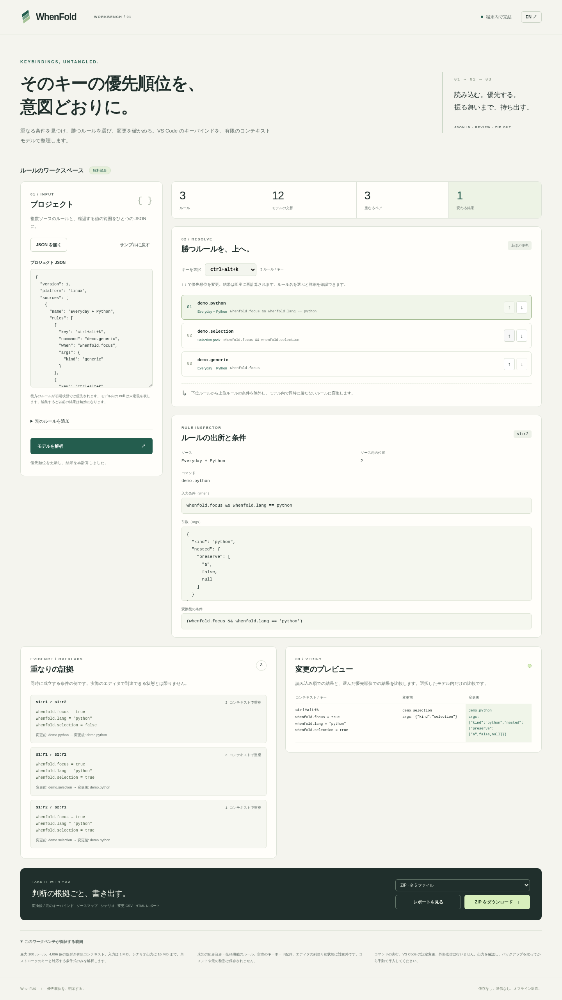
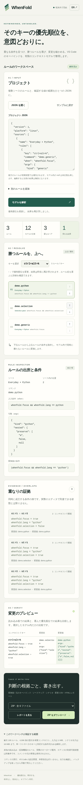

# WhenFold

**重なるショートカットに、明示的な優先順位と検証できる出力を。**

WhenFold is a local-only workbench for merging ordered VS Code shortcut snippets. It finds logical overlap, shows witness contexts and the imported winner, lets you explicitly move a rule up or down, then exports disjoint guarded rules with a command/args behavior delta.

Open `dist/index.html` directly in a modern browser. No account, server, extension installation, network request, or editor settings access is needed. The standalone file has no runtime dependencies. Japanese and English UI are included.

## Try the exact example

1. Open the standalone file and choose **モデルを解析 / Analyze model**
2. Review the three `ctrl+alt+k` rules and the 12 declared contexts
3. Move `demo.python` above `demo.selection`
4. Exactly one modeled outcome changes: focused + selected + Python, from selection to Python
5. Preview the handoff report and download the six-file ZIP

The example uses only fictitious command IDs. The app never executes them. Installing this demonstration pack will not create those commands in your editor.

## The handoff

- `keybindings.json`: guarded shortcut rules, command IDs and args preserved as JSON data
- `original-keybindings.json`: normalized ordered input rules for comparison
- `source-map.json`: source entry, output index, original condition, generated guard and priority rank
- `behavior-delta.csv`: every modeled command/args change, including explicit args-presence fields
- `scenarios.json`: every context/shortcut result, including unchanged outcomes and fall-through
- `report.html`: self-contained, readable EN/JA handoff and review boundary

Default compilation preserves the imported bottom-to-top winner. Reordering is an explicit choice. Equivalent command/args from a different source is not counted as a behavior change; the scenarios retain source rule IDs. Comments and original formatting are not preserved.

## Scope that can be inspected

- Maximum 100 ordered rules, 16 context keys and 4,096 finite context combinations
- Explicit `linux`, `windows` or `mac` target; modifier-order normalization within that platform only
- Lowercase single-stroke keys: letters, digits, f1–f19, arrows and the named navigation/editing keys listed in [the input contract](docs/input-contract.md)
- Boolean or string context keys with explicit finite domains; `null` means **absent**, never a literal null context value
- Conditions: `!`, `&&`, `||`, parentheses, `==`, `!=`, boolean constants, declared keys and single-quoted strings
- 1 MiB input; 2,048-character input conditions; 32,768-character generated guard; 1 MiB total guards; 16 MiB scenario-row budget; conservative 4,096-term / 65,536-literal consumer-normalization budget

Reject rather than guess: removal rules, leading-caret bubbling commands, empty-command suppression, unknown fields (including `systemWide`), chords, ambiguous aliases, scan codes, punctuation keys, regex, comparisons, `in/not in`, numeric/object contexts, undeclared keys and platform/browser-folded built-in constants. See the contract for exact limits and examples.

Logical context combinations are not proof that the state is reachable in VS Code. Unknown built-in and extension rules are outside coverage unless supplied in the correct order. Physical keyboard-layout mapping is outside the application's analysis. Native consumer testing uses a US/X11 fixture, not every platform/layout/extension.

## Why this exists

VS Code's own shortcut UI and troubleshooting log are useful for inspection. Keybinding Conflict Scanner documents that it cannot determine the winner; Shortcut Sensei documents a distinction between exact duplicates and potential overrides without resolving actual condition precedence. WhenFold focuses on a supplied-order, bounded-model handoff with explicit precedence and reviewable behavior changes. This is a documented workflow comparison, **not a novelty or patentability claim**, and demand/time savings are unvalidated. [Sources and comparison](docs/research.md)

For each rule, compilation applies the standard Boolean transformation:

`original condition && !(union of higher-priority original conditions)`

This makes supported exported guards mutually exclusive by construction, independent of their output order. Exhaustive scenarios establish behavior only within the declared finite model.

## Develop and verify

Node 22 or 24 and Python 3.12+:

```
npm ci --ignore-scripts
npm run check
npm run fixture
npm run test:oracle
npm run test:review
npm run serve
npm run test:browser
npm run test:native
npm run package
```

Browser and native-editor tests require a sandbox-capable host. The checked-in workflow uses `ubuntu-22.04`; the native command runs under `xvfb-run -a`. Never add `--no-sandbox` to work around a blocked environment.

The mandatory independent oracle uses hash-pinned, unmodified Microsoft VS Code **1.96.4** sources, including `ContextKeyExpr`, `KeybindingParser`, `USLayoutResolvedKeybinding`, and `KeybindingResolver`. It reads the actual artifact JSON and compares winners, args and fall-through over all modeled scenarios, also with reversed export order. The production parser/compiler is separately implemented and does not import upstream resolver code.

[Verified hosted run](https://github.com/Masanori-Spec/when-fold/actions/runs/37209599757) passed all three jobs at commit `4eecbc7652084eb7aac3e0bc93aab759eded3422`: 146 tests on Node 22 and 24, the independent upstream/differential checks, **15/15 sandboxed browser scenarios**, actual-download oracle checks, and **24 real keypresses in official VS Code 1.96.4** using disposable profiles. The actual browser-downloaded report was rendered offline into a three-page A4 landscape PDF; all pages and JA/EN desktop/mobile screenshots were inspected. No browser or editor sandbox bypass is used. [Evidence and scope](docs/verification.md)

### Actual screenshots

Synthetic fixture from the linked passing run:



<details><summary>Japanese mobile layout at 390px</summary>



</details>

[Actual exported report, printed to A4 PDF](docs/evidence/hosted/downloaded-report-A4.pdf)

## Safety and licensing

The browser processes inputs as data, renders imported text using `textContent`, and escapes the report. No imported command is evaluated. CSV text cells protect formula-leading strings. A disposable editor harness accepts only the three harmless demonstration commands and custom fixture contexts.

This project does not select a new license for the original application code. Upstream files retain their existing licenses and notices; see [THIRD_PARTY_NOTICES.md](THIRD_PARTY_NOTICES.md). No paid services are required by the application. Workflow execution remains subject to the repository owner's existing GitHub limits.
